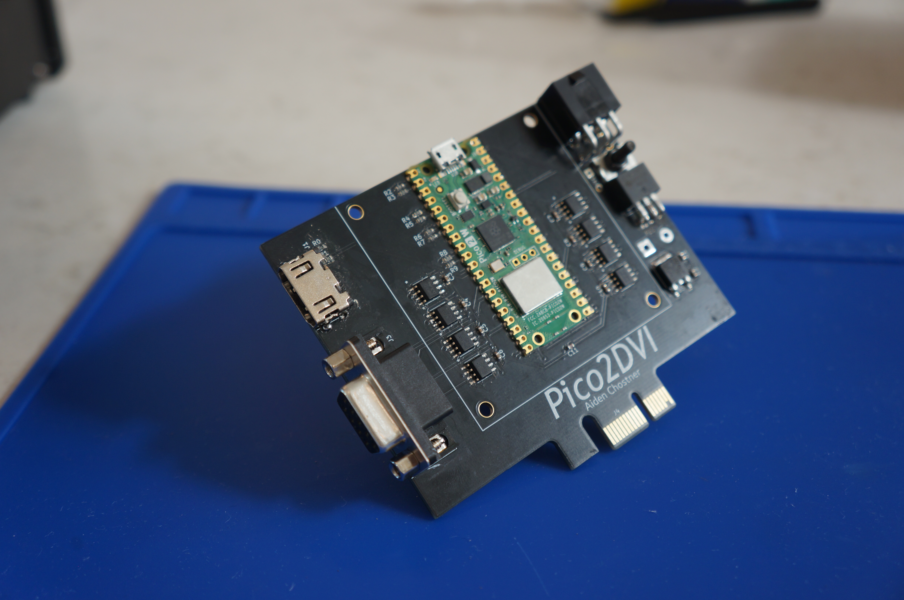
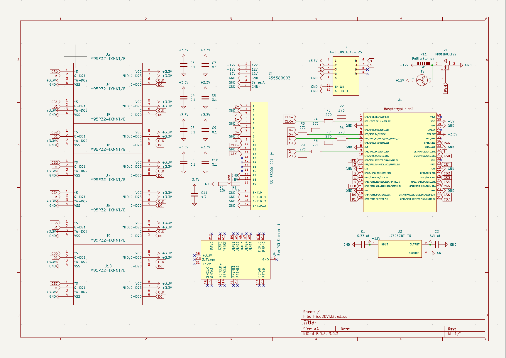
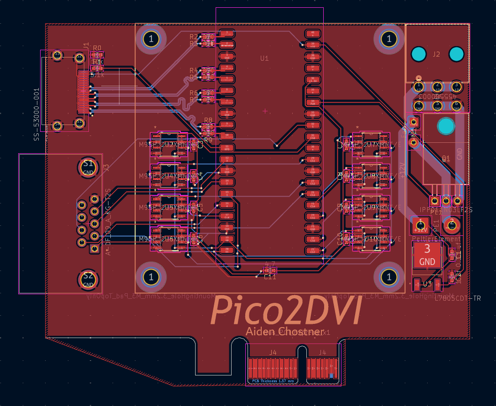
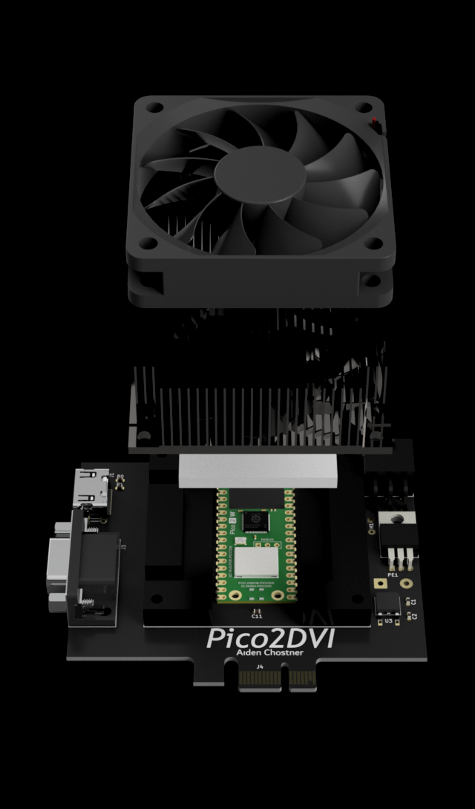
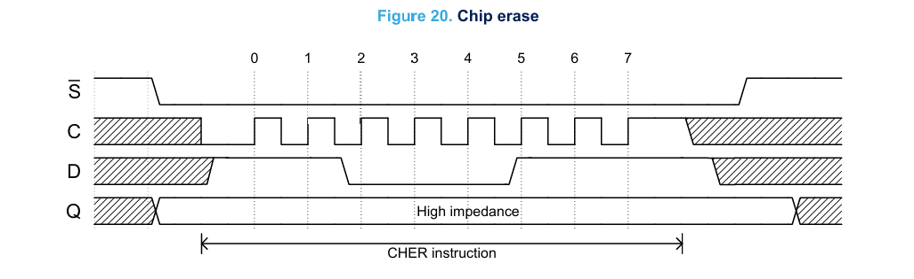

# Pico2DVI

## Story
A couple of months ago, I began exploring circuit design, and I liked the idea of creating my own custom graphics card. After some back and forth about choosing the requirements for the GPU, I settled on using a Raspberry Pi Pico as the main processor. It already had graphics libraries made for it, so it was simple to add HDMI support. I saw [PicoDVI by Luke Wren](https://github.com/Wren6991/PicoDVI/tree/master), but I wanted to add more RAM and some extra capabilities. I added 32MB of VRAM, which is about 250 times smaller and 36 million times slower than the memory on a modern GPU. (As you can probably tell, I was not going for speed.) The microprocessor also has WiFi and extra general-purpose pins. That means the card can take in user inputs like a keyboard and output data in ways other than just a screen. It can also get data from the Internet. For example, it can fetch information about the stock market. I prioritized the card being versatile instead of fast, allowing someone to do almost anything with it.

## Specs
* RP2350 Core
* 32 MB VRAM
* HDMI DVI
* Extra I/O
* Subzero Cooler
* Wifi 2.4 GHz

## Schematic

### I went through a couple variations changing:
* Memory
* Cooling
* Extra I/O Pins

## PCB

### Impedance 
The hardest part about designing the PCB was getting the DVI traces correct. At the clock speeds that DVI runs at, electricity starts to behave unpredictably. The signals start to degrade to the point where they cannot be properly received by the monitor. To correct the signals, I needed to use the impedance calculator in KiCad. It took a couple of attempts through trial and error to correctly calculate the impedance needed for DVI.

## Subzero Cooler

### Peltier Module
For HDMI to work properly the Raspberry Pi needs to be overclocked. This generates excess heat so I designed a subzero cooler. It uses a Peltier module which uses electricity to move heat from one side to the other. Using one on the GPU allows the core temperature to be lower than the room it is in.

## Memory

### Bitbanging
The protocol the memory chips use is called SPI. (Serial Peripheral Interface) Each chip uses four wires on a shared bus with every other chip, which saves valuable GPIO pins from the Raspberry Pi. I decided to bitbang the signals and code them manually. Each instruction, like reading or writing, has a different timing diagram like the one above. I made a function that had modular instructions so I did not have to manually code each one.

# Projects!
## Hello World

## Conway's Game of Life

## Ray Tracing

## Doom

## Future

